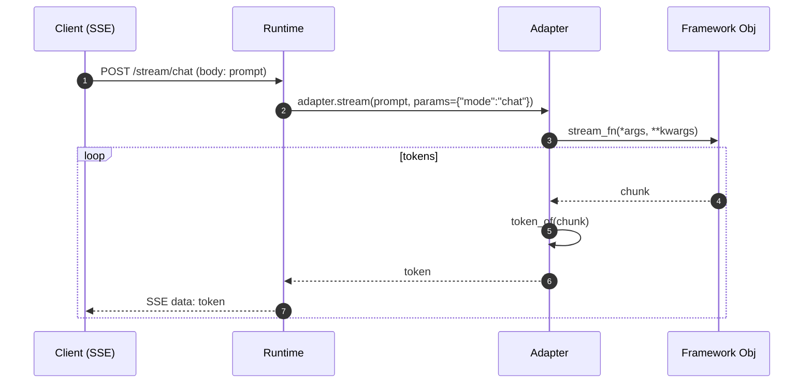

Here’s an **extensive README** you can drop in as `README.md`. It explains the *why* behind every design choice, with special focus on **async streaming**, **concurrency**, and **how this improves MLServer for modern agentic stacks** that call async LLMs (like OpenAI). It also documents the specific runtime you pasted (tracing, metrics, SSE, dynamic handlers, registry, etc.).

---

# Pluggable, Async LLM Runtime for MLServer

*(LangChain · LlamaIndex · CrewAI — streaming-first, MLflow-loaded, with Prometheus + OpenTelemetry)*

This project lets you serve **multiple LLM frameworks** behind a single, consistent **MLServer** runtime. It’s designed for **agentic workloads** and **browser / SDK streaming** with **SSE**—and it plays nicely with **MLflow** for model packaging & promotion.

```
.
├── README.md
├── llm
│   ├── adapters
│   │   ├── __init__.py
│   │   ├── base.py
│   │   ├── common.py
│   │   ├── crewai.py
│   │   ├── langchain.py
│   │   └── llamaindex.py
│   ├── capabilities.py
│   ├── metrics.py
│   ├── registry.py
│   └── runtime.py
├── pyproject.toml
└── pytest.ini
```

---

## Why this exists

Classic ML inference is **request/response**, sync, and CPU-bound. **LLM applications** and **agents** are different:

* They **stream tokens** (you want partial output ASAP).
* They call **async backends** (e.g., OpenAI, Azure OpenAI, Vertex, self-hosted gRPC).
* They need **observability** (Prometheus histograms; distributed traces).
* They often need **per-mode concurrency control** (chat vs. retrieve), and **graceful draining** on deploy/scale-in.

This runtime keeps the old path for pyfunc models untouched—while giving you a **purpose-built async runtime** for LLM frameworks.

---

## 🧠 Key Design Decisions — and *Why*

### 1) One contract: `CapLLM` (thin, stable)

Every framework adapter implements the same tiny protocol:

```python
async def load() -> None
async def reload_from_uri(uri: str) -> None
async def run(prompt: str, params: dict) -> str
async def stream(prompt: str, params: dict) -> AsyncIterator[str]
def supported_modes() -> list[str]
async def close() -> None
```

This keeps the core runtime simple and lets frameworks evolve independently.

---

### 2) **One runtime, many frameworks — Strategy pattern**

We use a **Strategy/Adapter** pattern. Each framework (LangChain, LlamaIndex, CrewAI) is a small subclass of a shared base:

* **`BaseMLflowAdapter`** centralizes:

  * MLflow loading: `mlflow.<framework>.load_model(uri)`
  * Async/sync invocation (sync offloaded in a thread to avoid blocking the event loop)
  * Streaming loop & token normalization
  * Mode routing via a simple `METHOD_MAP`:

    ```python
    METHOD_MAP = {
      "chat":     (("achat","chat"),      ("astream_chat",)),
      "query":    (("aquery","query"),    ("astream_query",)),
      "retrieve": (("aretrieve","retrieve"), None),
    }
    ```
* **Why this design?**

  * **DRY**: Shared logic lives once.
  * **Extensible**: Add a new framework by declaring `FRAMEWORK_NAME`, `SUPPORTED_MODES`, and `METHOD_MAP`. Done.
  * **Predictable**: The runtime doesn’t care which framework it’s talking to.

---

### 3) **Async everywhere for streaming**

#### Why async?

* **Token-by-token** delivery reduces time-to-first-byte and improves UX.
* Async event loops can handle **thousands of concurrent** SSE streams where thread-per-connection models choke.
* Agent stacks **call async LLMs** (e.g., OpenAI’s async clients, gRPC bidirectional streams). We must stay async to avoid head-of-line blocking.

#### Sync pitfalls (MLflow & legacy libs)

Many MLflow flavors expose **sync** methods (e.g., `predict`, or framework methods that aren’t `async`). If you call them directly on the event loop, **you block every other request**. That’s a bottleneck.

**Fix**: we use a small helper to detect sync vs. async and **offload sync calls** to a threadpool:

```python
if asyncio.iscoroutinefunction(fn):
    await fn(...)
else:
    await loop.run_in_executor(None, lambda: fn(...))
```

This keeps the loop responsive while still letting you use sync MLflow flavors today.

---

### 4) **True SSE streaming**

The runtime exposes `/stream/<mode>` endpoints that return **`text/event-stream`**. That makes streaming work in browsers and simple HTTP clients without WebSockets, while the backend adapters may talk gRPC / async HTTP / whatever they want.

* Each yielded chunk is normalized via `token_of(...)` (handles dicts like `{"delta": "Hi"}`, raw strings, etc.).
* Works well behind typical load balancers (LBs) that support long-lived HTTP connections.

---

### 5) **Observability baked-in (Prometheus + OpenTelemetry)**

* **Prometheus** metrics:

  * `llm_requests_total{model,mode,framework,endpoint}`
  * `llm_tokens_total{model,mode,framework,endpoint}`
  * `llm_latency_seconds` (Histogram) — labeled by `model, mode, framework, endpoint`
* **OpenTelemetry** tracing:

  * Configured via `OTEL_EXPORTER_OTLP_ENDPOINT` (default `http://otel-collector:4317`)
  * Spans around both sync and stream paths: `llm.<mode>`, `llm.stream_<mode>`

This gives you end-to-end visibility (client → MLServer → framework adapter → provider).

---

### 6) **Dynamic endpoints per mode**

When the model loads, the runtime inspects `adapter.supported_modes()` and **auto-registers**:

* `POST /chat` and `POST /stream/chat`
* `POST /query` and `POST /stream/query`
* `POST /retrieve` (no stream if adapter doesn’t support it)

No dead routes. Adding a new mode to an adapter gives you matching endpoints instantly.

---

### 7) **Minimal MLflow assumptions**

All adapters load via **MLflow flavors**:

* `mlflow.langchain.load_model(uri)`
* `mlflow.llama_index.load_model(uri)`
* `mlflow.crewai.load_model(uri)`

This keeps packaging & promotion simple (e.g., UC aliases / model registry). If the underlying object exposes async methods, we use them; if not, we safely offload sync calls.

---

### 8) **Concurrency limits + graceful draining**

The runtime includes a tiny **ConcurrencyManager**:

```python
semaphores = {mode: Semaphore(limit)}
await asyncio.wait_for(adapter.run(...), timeout=timeout_s)
```

* **Per-mode limits** protect hot paths (e.g., limit `chat` to 64 concurrent, allow `retrieve` to 256).
* **Timeouts** avoid runaway requests.
* On shutdown, the adapter’s `close()` is awaited (sync or async) so network clients / threadpools drain cleanly.

---

## 📐 Architecture Overview

```mermaid
flowchart TD
  subgraph Runtime[LLMUnifiedRuntime (MLServer)]
    RT[Dynamic Mode Handlers]
    OBS[Prometheus + OTEL]
    CM[ConcurrencyManager]
    AD[CapLLM Adapter]
  end

  subgraph FrameworkObject[MLflow-loaded Object]
    FO[(LangChain/LlamaIndex/CrewAI Object)]
  end

  subgraph Client
    C[Browser / SDK]
  end

  C -- POST /chat --> RT
  C -- POST /stream/chat (SSE) --> RT
  RT -- call .run/.stream --> AD
  AD -- calls --> FO
  RT -- metrics/traces --> OBS
  CM --- RT
```

---

## 📜 Streaming Sequence



---

## 🔌 Extensibility

Adding a new framework is **tiny**:

1. Subclass the base:

```python
class MyFrameworkAdapter(BaseMLflowAdapter):
    FRAMEWORK_NAME = "my_framework"           # mlflow.my_framework.load_model
    SUPPORTED_MODES = ("chat","query")
    METHOD_MAP = {
      "chat":  (("run_chat",), ("stream_chat",)),
      "query": (("run_query",), None),
    }
```

2. (Optional) Override `_stream_args(prompt, params)` if the streaming callable wants a special signature.
3. Register the factory:

```python
@ADAPTERS.register("my_framework")
def my_factory(model_uri: str, **_):
    return MyFrameworkAdapter(model_uri)
```

The runtime will **auto-generate** `/chat`, `/stream/chat`, `/query` endpoints on load.

---

## ⚙️ Runtime Details (the code you pasted)

### Tracing init (OpenTelemetry)

```python
def init_tracing(service_name: str):
    res = Resource.create({"service.name": service_name})
    provider = TracerProvider(resource=res)
    exporter = OTLPSpanExporter(
        endpoint=os.getenv("OTEL_EXPORTER_OTLP_ENDPOINT","http://otel-collector:4317"),
        insecure=True,
    )
    provider.add_span_processor(BatchSpanProcessor(exporter))
    trace.set_tracer_provider(provider)
```

* Export spans to your OTEL collector.
* Enable by setting `OTEL_EXPORTER_OTLP_ENDPOINT`.

### ConcurrencyManager

```python
class ConcurrencyManager:
    def __init__(self, limits: Dict[str, int], timeout_s: int):
        self._sems = {k: asyncio.Semaphore(v) for k, v in limits.items()}
        self._timeout = timeout_s
    async def run(self, mode: str, coro):
        async with self._sems.get(mode, asyncio.Semaphore(1000)):
            return await asyncio.wait_for(coro, timeout=self._timeout)
```

* Per-mode semaphores.
* **Hard timeouts** via `asyncio.wait_for`.

### Dynamic endpoints (per mode)

```python
def _register_mode_handlers(self):
    for mode in self._adapter.supported_modes():
        setattr(self.__class__, mode, self._make_handler(mode))
        setattr(self.__class__, f"stream_{mode}", self._make_stream_handler(mode))
```

* Registers `/chat`, `/stream/chat`, `/query`, etc. at load time.
* Browser-friendly **SSE** via `StreamingResponse`.

### Metrics (Prometheus)

```python
REQS = Counter("llm_requests_total", ..., ["model","mode","framework","endpoint"])
TOKS = Counter("llm_tokens_total", ..., ["model","mode","framework","endpoint"])
LAT  = Histogram("llm_latency_seconds", ..., ["model","mode","framework","endpoint"])
```

* Emitted in both sync and streaming paths with consistent labels.

### Adapter registry pattern

```python
class Registry:
    def register(self, name): ...
    def create(self, name, **kwargs): ...
```

* Clean separation: runtime doesn’t know how to build frameworks; it just asks the registry.

---

## 🧵 Sync vs. Async: why offloading matters

**Problem**: MLflow models (and many framework APIs) provide **sync** methods. In an async server, calling these directly **blocks the event loop**, delaying every other request and breaking streaming responsiveness.

**Solution**:

* Detect if a method is a coroutine.
* If not, **run it in a threadpool** (`loop.run_in_executor(None, ...)`).
* This keeps **latency predictable** and **streams flowing** even under load.

This pattern is applied in the adapters so that **you can use today’s MLflow flavors** while still reaping the benefits of async.

---

## 🛠 Usage

### model-settings.json

```json
{
  "name": "my-llm",
  "implementation": "llm.runtime.LLMUnifiedRuntime",
  "parameters": {
    "framework": "llamaindex",              // or "langchain" / "crewai"
    "model_uri": "models:/my-index/Production",
    "per_mode_limits": {"chat": 64, "query": 64, "retrieve": 128},
    "timeout_seconds": 60
  }
}
```

### Environment

* `PROM_PORT=9090` → exposes Prometheus metrics
* `OTEL_EXPORTER_OTLP_ENDPOINT=http://otel-collector:4317`
* `OTEL_SERVICE_NAME=llm-server` (optional label)

### Endpoints (auto-registered)

* `POST /chat` → body is raw prompt (bytes/string)
* `POST /stream/chat` → **SSE** stream
* `POST /query`, `POST /stream/query`
* `POST /retrieve` (stream only if adapter supports it)

**Note**: the provided runtime reads the raw body as the prompt (for simplicity). If you want JSON (`{"input": "...", "params": {...}}`), you can add a small decode helper—this design doesn’t block you.

---

## ✅ What improves for agent frameworks

* **No more blocking**: OpenAI / Azure clients are async; we keep the whole chain async.
* **Faster UX**: streaming tokens out as soon as they arrive (SSE) instead of waiting for the whole response.
* **Better ops**: per-mode concurrency caps, hard timeouts, and metric/tracing hooks.
* **Simple extension**: add a framework with \~10 lines (just mappings & flavor name).

---

## 🔍 FAQ

**Q: Why SSE and not WebSockets?**
SSE is **built-in** to browsers and proxies well through HTTP infrastructure. For token streams, it’s perfect. If you need bidirectional, you can add WS, but SSE keeps the surface small and robust.

**Q: What about “predict()” from MLflow being sync?**
We never call it directly on the loop. Sync work is offloaded. If a framework offers `async` methods, we prefer those immediately.

**Q: Can I add new modes?**
Yes—extend `SUPPORTED_MODES` and `METHOD_MAP` in your adapter. The runtime will expose corresponding endpoints automatically.

**Q: How do I pass special arguments (like LangChain’s `{"input": ...}`)?**
Adapters can override `_stream_args(prompt, params)` (and similarly shape calls in `run()`) to fit framework-specific call signatures—no core changes required.

---

## 🧩 What’s next (optional ideas)

* Input JSON schema & edge validation (e.g., Pydantic) for request payloads.
* Pluggable memory backends for multi-turn chat (Redis, in-proc).
* UC alias polling for live promotions (if you want hot-reload).
* Gateway sidecar that bridges gRPC streaming ↔ SSE for multi-hop deployments.

---

If you want this README dropped into your repo with example requests or a tiny `docker-compose` (MLServer + OTEL + Prometheus + Grafana) to try it live, say the word and I’ll wire it up.
