Here’s a **more extensive README** that fully explains the **decisions**, **trade-offs**, and **patterns** in this design — so anyone reading it understands not just *what* the stack is, but *why* it’s built this way.

---

# Pluggable LLM Serving Stack

*(MLServer + Unity Catalog Hot-Reload + Streaming Gateway + Observability)*

---

## 🎯 Purpose

This stack lets you **serve both classic ML models and modern LLM applications** in one consistent MLServer deployment:

* **Classic PyFunc models** (scikit-learn, XGBoost, etc.) → use stock `mlserver-mlflow` runtime, no changes.
* **LLM frameworks** (LlamaIndex, LangChain, CrewAI, future…) → use a **single pluggable runtime** with:

  * **Token streaming** over gRPC and HTTP SSE
  * **Hot-reload from Unity Catalog stages**
  * **Prometheus metrics + OpenTelemetry tracing**
  * **Memory backends** for conversational agents
  * **Concurrency controls & graceful draining**

---

## 🧠 Key Design Decisions — and *Why*

### 1. **Keep MLServer’s existing PyFunc runtime untouched**

* **Why**: Thousands of existing ML models already work with `mlserver-mlflow`.
  Touching that path adds risk and maintenance cost.
* **How**: We add *one* new runtime — `LLMUnifiedRuntime` — for LLM workloads.
  MLServer keeps running multiple runtimes in parallel.

---

### 2. **One runtime, many frameworks — Strategy pattern**

* **Why**: LlamaIndex, LangChain, CrewAI all have different APIs and streaming behavior.
  We hide that behind a `CapLLM` interface.
* **How**: Each framework is an **Adapter** (Strategy):

  ```python
  class CapLLM(Protocol):
      async def predict_text(...)
      async def stream_tokens(...)
  ```

  Adding a new framework = one new adapter file, no core changes.

---

### 3. **Async everywhere for streaming**

* **Why async?**

  * LLMs often stream tokens one-by-one → blocking I/O wastes threads.
  * Async I/O means one process can handle thousands of open SSE or gRPC streams.
* **Impact**: Lower latency between token generation and delivery to clients, even under load.

---

### 4. **Gateway sidecar (HTTP SSE → gRPC bridge)**

* **Why not just expose MLServer over HTTP?**

  * gRPC streaming works well for backend ↔ backend, but browsers can’t consume it directly.
  * SSE (Server-Sent Events) is a simple, built-in browser API for streaming text.
* **How**: Gateway is a small FastAPI app that:

  * Opens a gRPC stream to MLServer
  * Pushes each token to browser clients over SSE
  * Sends heartbeats to keep connections alive through load balancers

---

### 5. **Hot-reload from Unity Catalog stages**

* **Why**:

  * In production, models are promoted (e.g. `Staging` → `Production`) without downtime.
  * Restarting pods for each change = slow and risky.
* **How**:

  * Background task polls UC stage for new versions
  * On change → reloads model in-memory
  * No re-indexing needed for LlamaIndex; just swap engine instance

---

### 6. **Memory store is pluggable**

* **Why**:

  * Some LLMs are stateless, some need conversation history.
  * Different orgs want in-proc memory, Redis, or Delta tables in Unity Catalog.
* **How**:

  * Memory is an interface with multiple backends
  * Selected via config; adapters use it if available

---

### 7. **Observability baked-in**

* **Prometheus**: request count, token count, latency histograms
* **OpenTelemetry**: distributed tracing from client → gateway → runtime → model
* **Why**:

  * You *will* debug production LLM issues; better to instrument early.
  * Token counters + latency metrics are essential for scaling and cost monitoring.

---

### 8. **Concurrency limits + graceful draining**

* **Why**: Protects service from overload; avoids killing in-flight requests on deploys.
* **How**:

  * Configurable concurrency semaphore
  * SIGTERM → stop accepting new requests, wait for active streams to finish

---

## 📐 Architecture Overview

```mermaid
flowchart TD
  subgraph UC[Resolvers]
    RS1[UC Stage Resolver]
    RS2[Static URI Resolver]
  end

  subgraph Adapters
    A1[LlamaIndex Adapter]
    A2[LangChain Adapter]
    A3[(Future: CrewAI Adapter)]
  end

  subgraph MLS[MLServer Pod]
    direction TB
    RT[LLM Unified Runtime<br/>CapLLM + Plugins]
    REG[Plugin Registry<br/>(adapters, resolvers, memory)]
    MEM[Memory Store<br/>inproc / redis / UC Delta]
    OBS[(Prometheus + OTEL)]
    RT --- REG
    RT --- MEM
    OBS --- RT
  end

  subgraph GW[Gateway Sidecar]
    GWAPI[HTTP SSE]
    GWgRPC[gRPC Client]
    GWAPI --> GWgRPC
  end

  subgraph Client
    C1[Browser / SDK]
  end

  C1 -- SSE --> GWAPI
  GWgRPC -- stream --> RT
  RT -- resolve --> RS1
  RT -- resolve --> RS2
  RT -- uses --> A1
  RT -- uses --> A2
  RT -- uses --> A3
```

---

## 📜 Streaming Sequence

```mermaid
sequenceDiagram
  autonumber
  participant B as Browser / SDK
  participant GW as Gateway (SSE)
  participant MS as MLServer (gRPC)
  participant RT as LLM Runtime
  participant UC as UC Resolver

  Note over UC,RT: UC resolver resolves stage→version and hot-reloads model

  B->>GW: GET /v2/models/{model}/stream
  GW->>MS: gRPC ModelStreamInfer
  MS->>RT: predict_stream
  activate RT

  RT-->>MS: token #1..N
  MS-->>GW: token #1..N
  GW-->>B: SSE data: token #1..N

  RT-->>MS: [end-of-stream]
  deactivate RT
  MS-->>GW: close
  GW-->>B: close
```



---

## 🔌 Extensibility

Adding a new LLM framework (e.g. **CrewAI**) is just:

1. Create `server/adapters/crewai.py`:

   * Implement `predict_text()` and `stream_tokens()` with the CrewAI API.
2. Register it in `server/adapters/__init__.py`.
3. Deploy a model with `framework="crewai"` in `model-settings.json`.

No changes to:

* Gateway
* Runtime orchestration
* Observability
* Hot-reload logic

---

## 🚦 Local Development

```bash
# Install deps
poetry install

# Run tests with coverage
poetry run pytest --cov=server --cov=gateway --cov-report=term-missing

# Start MLServer (with both PyFunc and LLM models)
poetry run mlserver start .

# Start SSE gateway
poetry run uvicorn gateway.app:app --host 0.0.0.0 --port 8080
```

---

## ✅ Testing Strategy

We target **≥90% coverage**:

* **Unit tests** for adapters, resolvers, memory stores
* **Integration tests**: hot-reload, SSE → gRPC bridge
* **Failure mode tests**: timeouts, cancelled streams, bad configs

